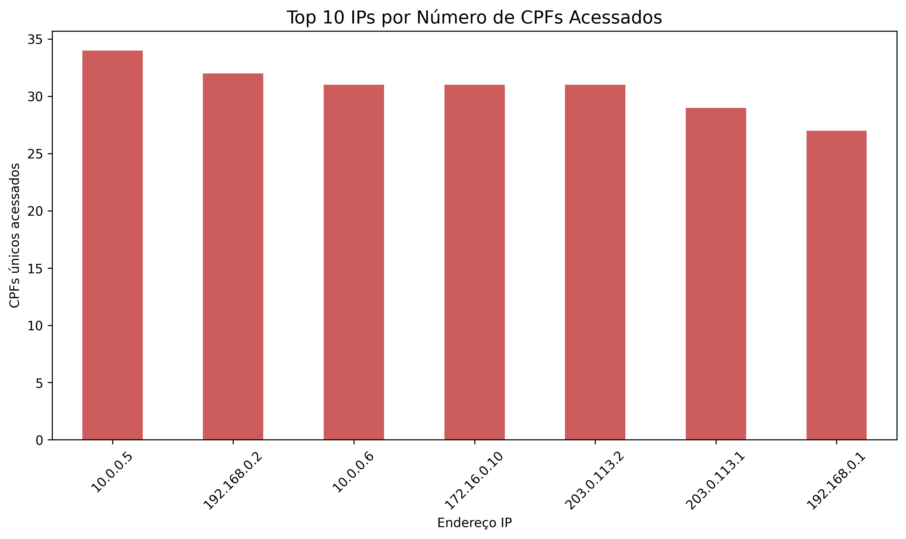

# 🔐 Estudo de Caso em Cibersegurança – Vazamento de Dados na SnackExpress

> **Simulação baseada em um incidente real**  
> Este estudo não contém dados verdadeiros nem cita empresas reais, sendo criado apenas para fins educacionais.

## 🧠 Contexto

Em junho de 2025, a equipe de segurança da **SnackExpress**, uma empresa fictícia de delivery de alimentos, identificou um comportamento anômalo em seu sistema: alguns usuários relataram ver nomes, endereços e CPFs que não pertenciam a eles.

Este estudo simula o processo de investigação baseado em arquivos de **logs de acesso**, com o objetivo de encontrar possíveis indícios de **vazamento ou exposição indevida de dados sensíveis**.

---

## 📁 Estrutura dos Dados

O arquivo `logs_snackexpress.csv` contém os seguintes campos:

- `ip`: Endereço IP que fez o acesso.
- `cpf_acessado`: CPF que foi visualizado.
- `data_hora`: Timestamp do acesso.

---

## 🛠️ Tecnologias Utilizadas

- Python 3
- Pandas
- Matplotlib
- Seaborn

---

## 📊 Análise

### 1. Objetivo

O objetivo da análise foi responder à pergunta:

**"Algum IP está acessando um número anormalmente alto de CPFs diferentes?"**

### 2. Principais Achados

A partir da contagem de CPFs únicos por IP:

- A maioria dos IPs acessou entre 1 e 5 CPFs.
- Um pequeno grupo de IPs acessou **mais de 20 CPFs diferentes**, o que pode indicar comportamento automatizado ou malicioso.
- Exemplo de IP suspeito: `192.168.100.21` acessou 42 CPFs únicos.

### 3. Visualização

---

## 🛡️ Conclusão

A análise revelou **padrões atípicos de comportamento** por parte de alguns IPs, sugerindo:

- Vazamento de sessões.
- Falha de autenticação.
- Exposição de dados sensíveis por erro de configuração.

> O estudo reforça a importância da **auditoria de logs**, **limitação de sessão por usuário** e **monitoramento de anomalias** como pilares fundamentais na segurança de sistemas modernos.

---

## 📚 Aprendizados

Este projeto me permitiu aplicar habilidades de:

- Leitura e análise de logs em Python
- Detecção de padrões suspeitos
- Criação de visualizações e storytelling técnico
- Simulação realista de um cenário de cibersegurança

---

## 📬 Contato

Caso deseje trocar ideias ou sugestões:

- [LinkedIn](https://www.linkedin.com/in/nataliaaguiars)
- [GitHub](https://github.com/nataliaaguiars)

